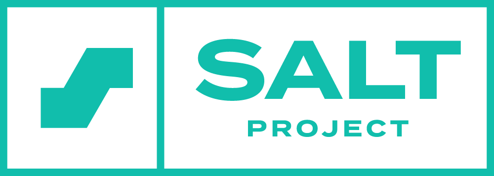

# Salt starter pack module

Salt module that installs and configures a starter pack of programs. Get a quick start on your Linux machine.

## Licence

GNU General Public License v3.0.

<br>



## Requirements

This module has been tested on Linux Debian 11. For UFW (Uncomplicated Firewall), the directory for configurations varies between Linux distributions. If you wish to use this module on other distributions, change the path where the modified rules are saved to, to an approriate one. Other critical differences might exist.

## How to use

You need to have salt-master installed on your main machine and salt-minion either locally on your main machine or another machine, setup as a minion to the master.

1. Download Git

```
$ sudo apt-get install git
```

2. Navigate to /srv/salt. Create the directory if it doesn't exist.

```
$ cd /srv/salt
```

3. Clone the repository

```
$ git clone https://github.com/tuomasvalkamo/starter-module
```

4. Run the module

To a local minion:

    $ sudo salt-call --local state.apply starter-module

To remote minions:

    $ sudo salt '*' state.apply starter-module

## How to test that it works

A hands-on test would be establishing an SSH connection to the minion machine.

1. Install openssh-client

```
$ sudo apt-get update
$ sudo apt-get install openssh-client
```

2. Connect to the minion machine

```
$ ssh user@IP_address
```

If you are able to connect, you know that at least the SSH service was installed and enabled.

## What it does

This Salt module installs:

- UFW (Uncomplicated Firewall) - A simple firewall service
- Micro - Text editor
- Curl - A command line tool for transferring data with URL syntax
- Git - Version control
- Nmap - Network scanner
- Netcat - Networking utility
- Mitmproxy - Man-in-the-middle proxy
- Openssh-server - SSH server
- Apache2 - Web server

UFW is configured to allow 22/tcp (SSH) and 80/tcp (HTTP) traffic. Micro is set as the default editor for all users. The default Apache webpage is replaced with a basic HTML template file.

---

This module was made as an assignment in the [Configuration Management Systems](https://terokarvinen.com/2022/palvelinten-hallinta-2022p2/) -course at Haaga-Helia University of Applied Sciences.

**Read my [report](https://tuomasvalkamo.com/how-to-create-your-own-salt-module/) on the creation process of this module.**

Previous assignments:

- [Week 1](https://tuomasvalkamo.com/CMS-course/week-1/)
- [Week 2](https://tuomasvalkamo.com/CMS-course/week-2/)
- [Week 3](https://tuomasvalkamo.com/CMS-course/week-3/)
- [Week 4](https://tuomasvalkamo.com/CMS-course/week-4/)
- [Week 5](https://tuomasvalkamo.com/CMS-course/week-5/)
- [Week 6](https://tuomasvalkamo.com/CMS-course/week-6/)
